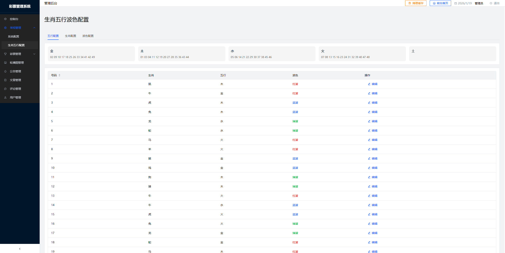
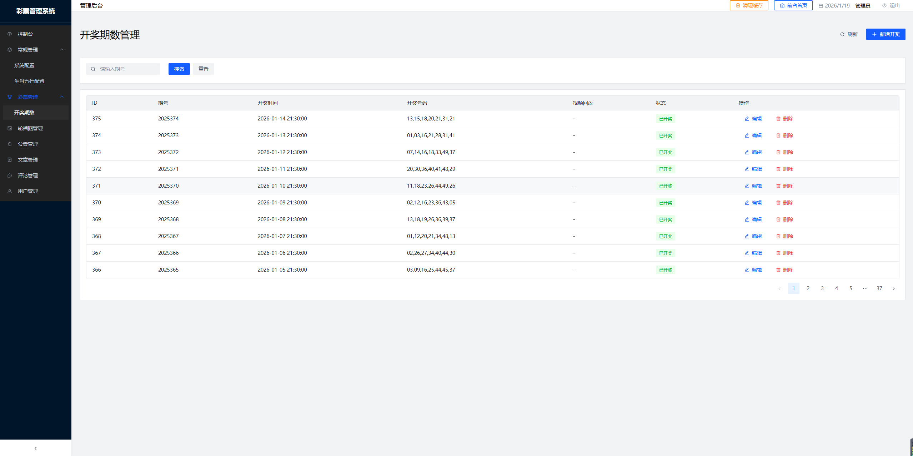
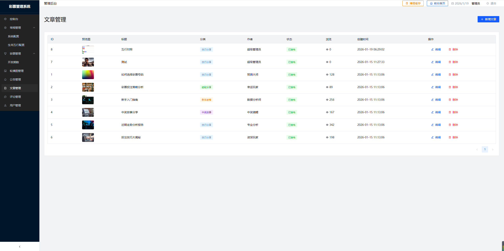

# 六合彩彩票网站系统


联系技术飞机：@daji855


基于 React + ThinkPHP 的彩票资讯与开奖查询平台。

## 技术栈

| 模块 | 技术 |
|------|------|
| H5前端 | React + Vite + Tailwind CSS |
| 管理后台 | React + Ant Design |
| 后端API | ThinkPHP 8.0 |
| 数据库 | MySQL |

## 项目结构

```
code/
├── H5前端页面/          # H5前端（React）
├── 管理后台设计/        # 管理后台（React + Ant Design）
└── api/                 # 后端API（ThinkPHP）

index.html               # 前端入口
admin/index.html         # 管理后台入口
api/                    # 后端服务
```

## 功能特性

- 彩票开奖查询
- 历史开奖记录
- 号码逐个揭晓动画
- 公告发布管理
- 数据下载

## 定时任务


定时发布开奖（1Panel Cron）：
```bash
curl -s http://your-domain/api/public/cron_publish.php
```
Cron表达式：`*/1 * * * *`（每分钟）

## License





MIT
